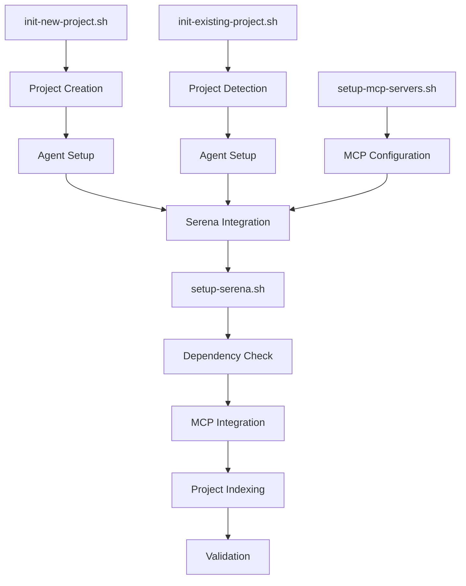

# Serena MCP Implementation Plan

## Overview

This document outlines the technical implementation strategy for integrating Serena MCP (Model Context Protocol) server into the Claude Code initialization system to provide semantic code analysis and intelligent context persistence.

## Goals

### Primary Objectives

- **Enhance Context Intelligence**: Provide semantic code understanding beyond basic file reading
- **Reduce Token Usage**: Deliver targeted context instead of full file contents
- **Improve Development Experience**: Enable intelligent code search and analysis
- **Maintain System Reliability**: Ensure graceful degradation when Serena is unavailable

### Success Metrics

- ✅ Serena MCP successfully integrates with Claude Code in >90% of project types
- ✅ Context retrieval shows measurable token usage reduction
- ✅ Setup process completes in <2 minutes for typical projects
- ✅ Fallback mechanisms handle dependency failures gracefully

## Architecture Overview

### System Integration Points



### Core Components

#### 1. Serena Setup Script (`setup-serena.sh`)

**Purpose**: Standalone script to configure Serena MCP for any project

**Key Functions**:

- Dependency validation (uvx, Docker alternatives)
- Claude Code MCP server registration
- Project-specific configuration
- Optional project indexing
- Setup validation and error recovery

#### 2. Integration Points

**Modified Scripts**:

- `init-new-project.sh`: Add Serena as final setup step
- `init-existing-project.sh`: Add Serena after project detection  
- `setup-mcp-servers.sh`: Include Serena as premium MCP option

#### 3. Documentation Enhancement

**Updated Templates**:

- CLAUDE.md generation with Serena usage examples
- Project-specific Serena configuration documentation
- Team onboarding and troubleshooting guides

## Implementation Phases

### Phase 1: Core Integration (Week 1)

#### 1.1 Create `setup-serena.sh` Script

**File Structure**:

```bash
setup-serena.sh
├── Command-line argument parsing
├── Dependency checking functions
├── Serena MCP integration logic
├── Basic error handling
└── Setup validation
```

**Command Line Interface**:

```bash
./setup-serena.sh [options]

Options:
  --project-path PATH     Project directory (default: current)
  --type TYPE            Project type (web, api, mobile, etc.)
  --framework FRAMEWORK  Detected framework
  --existing             Flag for existing project setup
  --read-only           Enable read-only mode (default: true)
  --index-now           Index project immediately
  --skip-validation     Skip post-setup validation
  --dry-run             Show what would be done
  --verbose             Enable detailed output
```

**Core Functions**:

```bash
check_dependencies()        # Verify uvx, provide alternatives
integrate_claude_mcp()      # Register Serena with Claude Code
generate_config()          # Create project-specific settings
validate_setup()           # Verify integration success
handle_errors()            # Graceful error recovery
```

#### 1.2 Modify Existing Init Scripts

**In `init-new-project.sh`** (after agent setup):

```bash
# Final step: Serena MCP integration
if command -v uvx >/dev/null 2>&1; then
    echo "🔍 Setting up Serena MCP for enhanced code intelligence..."
    if "$SCRIPT_DIR/setup-serena.sh" --project-path "$(pwd)" --type "$PROJECT_TYPE" --framework "$FRAMEWORK"; then
        echo "✅ Serena MCP integration completed"
    else
        echo "⚠️  Serena setup failed - continuing without semantic analysis"
    fi
else
    echo "💡 Install uvx for Serena MCP integration: curl -LsSf https://astral.sh/uv/install.sh | sh"
fi
```

**In `init-existing-project.sh`** (after copy_agents):

```bash
# Optional: Serena MCP integration for existing projects
if command -v uvx >/dev/null 2>&1; then
    echo "🔍 Setting up Serena MCP for existing project..."
    if "$SCRIPT_DIR/setup-serena.sh" --project-path "$(pwd)" --type "$PROJECT_TYPE" --framework "$FRAMEWORK" --existing; then
        echo "✅ Serena MCP integration completed"
    else
        echo "⚠️  Serena setup failed - project setup continues"
    fi
fi
```

#### 1.3 Update CLAUDE.md Generation

**Add Serena section to generate_agent_info() functions**:

```bash
generate_serena_info() {
    if command -v uvx >/dev/null 2>&1 && [ -f ".serena/project.yml" ]; then
        cat << 'EOF'

## Serena MCP Integration

This project includes Serena MCP for intelligent code analysis and semantic search.

### Capabilities
- **Semantic Search**: Find code by meaning, not just text matching
- **Project Analysis**: Understand structure and dependencies  
- **Pattern Recognition**: Identify similar implementations
- **Smart Context**: Targeted code retrieval for better Claude interactions

### Usage Examples
```

## Semantic code search

"Use Serena to find all authentication-related functions"

## Architecture analysis  

"Analyze the structure of this component with Serena"

## Pattern discovery

"Show me error handling patterns using Serena"

```markdown

### Configuration
- **Mode**: Read-only (safe analysis without modifications)
- **Context**: IDE-assistant optimized
- **Project Indexing**: [Status based on setup]
EOF
    else
        echo "<!-- Serena MCP not configured - install uvx and run setup-serena.sh -->"
    fi
}
```

### Phase 2: Enhanced Features (Week 2)

#### 2.1 Advanced Dependency Management

**Enhanced Dependency Checking**:

```bash
check_serena_dependencies() {
    local install_method=""
    
    # Check uvx (preferred)
    if command -v uvx >/dev/null 2>&1; then
        install_method="uvx"
    # Check Docker (fallback)
    elif command -v docker >/dev/null 2>&1; then
        install_method="docker"
        echo "⚠️  uvx not found, using Docker fallback"
    # Check local Python (manual)
    elif command -v python3 >/dev/null 2>&1; then
        install_method="python"
        echo "⚠️  Consider installing uvx for better Serena experience"
    else
        echo "❌ No suitable installation method found"
        return 1
    fi
    
    echo "INSTALL_METHOD=$install_method"
    return 0
}
```

#### 2.2 Intelligent Project Indexing

**Size-Based Indexing Logic**:

```bash
should_index_project() {
    local project_path="$1"
    local file_count=$(find "$project_path" -type f -name "*.js" -o -name "*.ts" -o -name "*.py" -o -name "*.go" -o -name "*.rs" | wc -l)
    
    if [ "$file_count" -gt 1000 ]; then
        echo "📊 Large project detected ($file_count files) - indexing recommended"
        return 0
    elif [ "$file_count" -gt 100 ]; then
        echo "📊 Medium project detected ($file_count files) - indexing optional"
        return 1
    else
        echo "📊 Small project ($file_count files) - indexing not required"
        return 2
    fi
}
```

#### 2.3 Framework-Specific Optimizations

**Framework-Aware Configuration**:

```bash
generate_framework_config() {
    local framework="$1"
    local project_type="$2"
    
    case "$framework" in
        "react"|"nextjs")
            echo "# React/Next.js specific Serena configuration"
            echo "include_patterns:"
            echo "  - '**/*.{js,jsx,ts,tsx}'"
            echo "  - '**/components/**'"
            echo "  - '**/pages/**'"
            echo "  - '**/app/**'"
            ;;
        "vue")
            echo "# Vue specific Serena configuration" 
            echo "include_patterns:"
            echo "  - '**/*.{js,ts,vue}'"
            echo "  - '**/components/**'"
            echo "  - '**/views/**'"
            ;;
        "express"|"fastify")
            echo "# Node.js API specific Serena configuration"
            echo "include_patterns:"
            echo "  - '**/*.{js,ts}'"
            echo "  - '**/routes/**'"
            echo "  - '**/controllers/**'"
            echo "  - '**/middleware/**'"
            ;;
    esac
}
```

### Phase 3: Production Polish (Week 3)

#### 3.1 Comprehensive Error Handling

**Error Recovery Matrix**:

```bash
handle_serena_error() {
    local error_code="$1"
    local context="$2"
    
    case "$error_code" in
        "dependency_missing")
            echo "🔧 Fix: Install uvx with: curl -LsSf https://astral.sh/uv/install.sh | sh"
            echo "   Alternative: Use Docker method (see documentation)"
            ;;
        "claude_mcp_failed") 
            echo "🔧 Fix: Ensure you're in a Claude Code project directory"
            echo "   Check: claude mcp list"
            ;;
        "indexing_timeout")
            echo "🔧 Fix: Large projects may take time - skip indexing for now"
            echo "   Note: Indexing will happen automatically on first use"
            ;;
        "permission_denied")
            echo "🔧 Fix: Check directory permissions"
            echo "   Try: sudo chown -R \$(whoami) ."
            ;;
    esac
}
```

#### 3.2 Validation and Health Checks

**Post-Setup Validation**:

```bash
validate_serena_integration() {
    local validation_score=0
    
    # Check MCP registration
    if claude mcp list 2>/dev/null | grep -q "serena"; then
        echo "✅ Serena registered with Claude Code"
        ((validation_score++))
    fi
    
    # Check project configuration
    if [ -f ".serena/project.yml" ]; then
        echo "✅ Serena project configuration exists"  
        ((validation_score++))
    fi
    
    # Test basic functionality
    if uvx --from git+https://github.com/oraios/serena serena project info >/dev/null 2>&1; then
        echo "✅ Serena project detection working"
        ((validation_score++))
    fi
    
    echo "Serena integration score: $validation_score/3"
    return $((3-validation_score))
}
```

#### 3.3 Team Integration Features

**Team Configuration Template**:

```yaml
# .serena/team.yml
team_settings:
  shared_patterns:
    - architecture_docs: "docs/architecture/**"
    - coding_standards: "docs/standards.md"
    - common_utilities: "src/utils/**"
  
  onboarding_contexts:
    - new_developer: "Get familiar with project structure"
    - feature_development: "Understanding component patterns"
    - bug_fixing: "Error handling and debugging patterns"
    
  project_knowledge:
    domain_concepts: "docs/domain/**"
    technical_decisions: "docs/decisions/**"
    troubleshooting: "docs/troubleshooting.md"
```

## Integration Testing Strategy

### Test Scenarios

#### 1. Happy Path Testing

- ✅ New React project with uvx available
- ✅ Existing Node.js API project migration  
- ✅ Large project requiring indexing
- ✅ Small project skipping indexing

#### 2. Error Path Testing

- ❌ uvx not installed (Docker fallback)
- ❌ Claude Code not in project directory
- ❌ Network issues during Serena installation
- ❌ Permission errors in project directory

#### 3. Integration Testing

- 🔄 Serena + Agent system interaction
- 🔄 Multiple MCP servers coexistence
- 🔄 Cross-platform compatibility (macOS, Linux)
- 🔄 Framework detection accuracy

### Performance Benchmarks

#### Setup Time Targets

- **Small projects** (<100 files): <30 seconds
- **Medium projects** (100-1000 files): <2 minutes  
- **Large projects** (>1000 files): <5 minutes + indexing

#### Resource Usage

- **Memory overhead**: <100MB during setup
- **Disk usage**: <50MB for Serena installation
- **Network**: <10MB download for initial setup

## Rollout Strategy

### Stage 1: Internal Testing

- Test with 5 different project types
- Validate error handling scenarios
- Performance optimization

### Stage 2: Opt-in Beta  

- Make Serena setup optional with `--enable-serena` flag
- Gather user feedback on setup experience
- Iterate on error messages and documentation

### Stage 3: Default Integration

- Enable Serena by default for all new projects
- Provide `--skip-serena` flag for opt-out
- Monitor adoption and error rates

### Stage 4: Advanced Features

- Team workspace configurations
- Custom semantic search patterns
- Integration with additional MCP servers

## Documentation Requirements

### User-Facing Documentation

1. **Setup Guide**: Step-by-step Serena integration
2. **Usage Examples**: Common semantic search patterns
3. **Troubleshooting**: Error resolution guide
4. **Team Guide**: Multi-developer workflow best practices

### Developer Documentation  

1. **API Reference**: setup-serena.sh options and functions
2. **Architecture Guide**: Integration points and data flow
3. **Extension Guide**: Adding custom Serena configurations
4. **Testing Guide**: Validation and testing procedures

## Risk Assessment and Mitigation

### High Risk Items

| Risk | Impact | Probability | Mitigation |
|------|--------|-------------|------------|
| uvx dependency issues | High | Medium | Docker fallback + clear instructions |
| Claude MCP integration failure | High | Low | Validation checks + error recovery |
| Large project indexing timeouts | Medium | Medium | Async indexing + skip options |

### Medium Risk Items  

| Risk | Impact | Probability | Mitigation |
|------|--------|-------------|------------|
| Framework detection inaccuracy | Medium | Low | Manual override options |
| Network connectivity issues | Medium | Medium | Offline mode + retry logic |
| Cross-platform compatibility | Low | Medium | Multi-platform testing |

## Success Metrics and Monitoring

### Key Performance Indicators

- **Setup Success Rate**: >90% successful integrations
- **User Adoption**: >70% of projects use Serena features
- **Error Recovery**: <5% require manual intervention
- **Performance**: Setup completes within time targets

### Monitoring Strategy

- Setup success/failure logging
- Integration validation results
- User feedback collection
- Performance metrics tracking

## Future Enhancements

### Phase 4: Advanced Intelligence (Future)

- **Custom AI Contexts**: Project-specific semantic understanding
- **Pattern Libraries**: Reusable code pattern databases
- **Team Knowledge Graphs**: Collective codebase understanding
- **Migration Assistance**: Intelligent code modernization

### Phase 5: Ecosystem Integration (Future)  

- **IDE Extensions**: Direct Serena integration in editors
- **CI/CD Integration**: Automated code analysis pipelines
- **Documentation Generation**: Auto-generated code documentation
- **Code Review Assistance**: Semantic code review suggestions

---

This implementation plan provides a comprehensive roadmap for integrating Serena MCP into the Claude Code initialization system while maintaining reliability, performance, and user experience standards.
